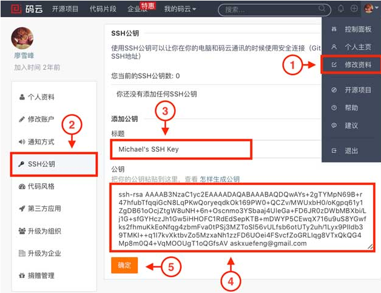
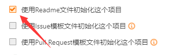
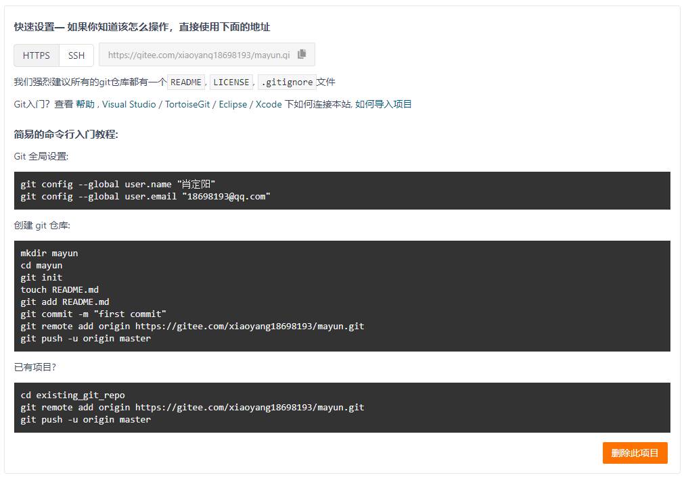

# Vue 中的问题汇集

# 项目托管

## 1.1 项目托管到码云

- 使用GitHub时，国内的用户经常遇到的问题是访问速度太慢，有时候还会出现无法连接的情况。如果我们希望体验 Git 飞一般的速度，可以使用国内的Git托管服务——[码云](https://gitee.com/)（[gitee.com](https://gitee.com/)）。和 `GitHub` 相比，码云也提供免费的 Git 仓库。此外，还集成了代码质量检测、项目演示等功能。对于团队协作开发，码云还提供了项目管理、代码托管、文档管理的服务，5人以下小团队免费。

### 1.1.1  安装Git 和 全局设置

#### 1.1.1.1 安装地址：

> https://git-scm.com/downloads

#### 1.1.1.2 Git 全局设置

- 在 Git 窗口输入命令 

  ```powershell
  git config --global user.name "用户姓名"
  git config --global user.email "用户邮箱"
  ```

#### 1.1.1.3 创建码云公钥

- 使用码云和使用GitHub类似，我们在码云上注册账号并登录后，需要先上传自己的SSH公钥。选择右上角用户头像 -> 菜单“修改资料”，然后选择“SSH公钥”，填写一个便于识别的标题，然后把用户主目录下的 `.ssh/id_rsa.pub` 文件的内容粘贴进去：

  > 1. mkdir .ssh	在终端输入此命令创建 .ssh 文件夹
  > 2. ssh-keygen -t rsa -C "你的邮箱@xxx.com"      生成公钥，全程三个回车即可生成
  > 3. 在Git终端输入   cat ~/.ssh/id_rsa.pub   即可查看生成的公钥
  > 4. 最后将获取到的公钥复制粘贴到码云的设置中的安全设置中的SSH公钥，在添加的时候需要验证密码



#### 1.1.1.4 新建项目

- 去掉以下选项的√



- 然后点击创建，如下则创建成功




### 1.1.2 项目文件

#### 1.1.2.1 .gitignore 上传忽略文件

> node_modules
>
> .idea
>
> .vscode
>
> .git

 

#### 1.1.2.2 README.md

- 此文档中描述了一些项目的信息

 

#### 1.1.2.3 LICENSE 开源协议

```shell
The MIT License (MIT)

Copyright (c) 2014 connors and other contributors

Permission is hereby granted, free of charge, to any person obtaining a copy of
this software and associated documentation files (the "Software"), to deal in
the Software without restriction, including without limitation the rights to
use, copy, modify, merge, publish, distribute, sublicense, and/or sell copies of
the Software, and to permit persons to whom the Software is furnished to do so,
subject to the following conditions:

The above copyright notice and this permission notice shall be included in all
copies or substantial portions of the Software.

THE SOFTWARE IS PROVIDED "AS IS", WITHOUT WARRANTY OF ANY KIND, EXPRESS OR
IMPLIED, INCLUDING BUT NOT LIMITED TO THE WARRANTIES OF MERCHANTABILITY, FITNESS
FOR A PARTICULAR PURPOSE AND NONINFRINGEMENT. IN NO EVENT SHALL THE AUTHORS OR
COPYRIGHT HOLDERS BE LIABLE FOR ANY CLAIM, DAMAGES OR OTHER LIABILITY, WHETHER
IN AN ACTION OF CONTRACT, TORT OR OTHERWISE, ARISING FROM, OUT OF OR IN
CONNECTION WITH THE SOFTWARE OR THE USE OR OTHER DEALINGS IN THE SOFTWARE.

```


### 1.1.3 建立仓库


#### 1.1.3.1 始化项目

- 将项目初始化，在项目根目录下执行此命令，创建一个空的Git仓库或重新初始化一个现有仓库，成功后会在根目录生成一个 `.git` 文件。

  ```powershell
  git init
  ```


#### 1.1.3.2 项目状态

- 显示工作目录和暂存区的状态。使用此命令能看到那些修改被暂存到了, 哪些没有, 哪些文件没有被 `Git tracked` 到。

  ```powershell
  git status
  ```


#### 1.1.3.3 将文件放在栈存区里面

- 此命令将要提交的文件的信息添加到索引库中(将修改添加到暂存区)，以准备为下一次提交分段的内容。 它通常将现有路径的当前内容作为一个整体添加，但是通过一些选项，它也可以用于添加内容，只对所应用的工作树文件进行一些更改，或删除工作树中不存在的路径了。

  ```powershell
  git add .
  ```


#### 1.1.3.4 提交信息

```powershell
git commit –m “提交信息”
git push
```

#### 1.1.3.5 连接仓库

- 在项目根目录下输入此命令连接仓库，地址是在创建项目仓库的时候生成的

  ```powershell
  git remote add origin https://gitee.com/xiaoyang18698193/mayun.git
  ```

- 之后，就可以正常地用`git push`和`git pull`推送了！

- 如果在使用命令`git remote add`时报错：

  ```powershell
  git remote add origin https://gitee.com/xiaoyang18698193/mayun.git
  fatal: remote origin already exists.
  ```

- 这说明本地库已经关联了一个名叫`origin`的远程库，此时，可以先用`git remote -v`查看远程库信息：

  ```js
  git remote -v
  git-osc git@git.oschina.net:username/impress.js.git (fetch)
  git-osc git@git.oschina.net:username/impress.js.git (push)
  origin  https://gitee.com/xiaoyang18698193/mayun.git (fetch)
  origin  https://gitee.com/xiaoyang18698193/mayun.git (push)
  ```

- 可以看到，本地库已经关联了`origin`的远程库，并且，该远程库指向GitHub。

- 我们可以删除已有的GitHub远程库：

  ```powershell
  git remote rm origin
  ```

- 再关联码云的远程库（注意路径中需要填写正确的用户名）：

  ```powershell
  git remote add origin https://gitee.com/xiaoyang18698193/mayun.git
  ```


#### 1.1.3.6 将项目 push 到仓库中

- 在项目根目录输入此命令将项目 push 到仓库中，注意：仓库不能为空。

  ```powershell
  git push -u origin master
  ```


## 1.2 Github 托管

### 1.2.1 创建仓库


### 1.3 同时托管码云和GitHub

- 一个本地库能不能既关联GitHub，又关联码云呢？

- 答案是肯定的，因为git本身是分布式版本控制系统，可以同步到另外一个远程库，当然也可以同步到另外两个远程库。使用多个远程库时，我们要注意，git给远程库起的默认名称是`origin`，如果有多个远程库，我们需要用不同的名称来标识不同的远程库。仍然以`learngit`本地库为例，我们先删除已关联的名为`origin`的远程库：

  ```powershell
  git remote rm origin
  ```

- 然后，先关联GitHub的远程库：

  ```shell
  git remote add github https://gitee.com/xiaoyang18698193/mayun.git
  ```
  

- 注意，远程库的名称叫`github`，不叫`origin`了。

- 接着，再关联码云的远程库：

  ```powershell
  git remote add gitte https://gitee.com/xiaoyang18698193/mayun.git
  ```

  - 同样注意，远程库的名称叫`gitee`，不叫`origin`。

  - 现在，我们用`git remote -v`查看远程库信息，可以看到两个远程库

- 如果要推送到GitHub，使用命令：

  ```powershell
  git push github master
  ```

- 如果要推送到码云，使用命令：

  ```powershell
  git push gitee master
  ```

- 这样一来，我们的本地库就可以同时与多个远程库互相同步


#### 1. router-link嵌套a

- 当router-link里面嵌套a标签的时候a不用写 href，而 router-link 也会吧to里面的路径给a标签

  ```html
  <router-link to="/about/study" tag="li" >
    <a> </a>
  </router-link>
  ```

- 等价于

  ```html
  <li>
    <a href="/about/work"> </a>
  </li>
  ```


#### 2. router-link添加事件无效

- 在 `<router-link @mouseover="">` 上我们添加点击事件总是无效的，这是因为 `<router-link>` 在HTML5历史记录模式下，`router-link` 将拦截点击事件，以便浏览器不会尝试重新加载页面。但如果想要添加点击事件怎么办呢？  Vue 给出了一种解决办法，在事件上加上修饰符  “`.native`”，示例如下：

  ```html
  <router-link @mouseover.native="">
  ```


#### 3. 在引入外部的插件的时候

- 在引入外部插件的时候可能会有这样的报错

  ```shell
  Module build failed: ParseError: e:\My Study\09-Vue\demo\02-项目\01-音乐播放器\demo\src\assets\bootstrap\dist\css\bootstrap.css:4:168
     1| // style-loader: Adds some css to the DOM by adding a <style> tag
     2|
     3| // load the styles
     4| var content = require("!!../../../../../node_modules/css-loader/index.js??ref--7-1!../../../../../node_modules/postcss-loader/lib/index.js??ref--7-2!./bootstrap.css");
  -----------------------------------------------------------------------------------------------------------------------------------------------------------------------------^
     5| if(typeof content === 'string') content = [[module.id, content, '']];
     6| if(content.locals) module.exports = content.locals;
     7| // add the styles to the DOM
  
  expected "indent", got ";"
  ```


- 像这种情况，在 `webpack.base.conf.js` 文件中添加 `include[]`

  ```json
  {
    test: /\.css$/,
    loader: 'style-loader!css-loader!stylus-loader',
    include: []
  }
  ```

#### 4.  导入bootstrap

##### 安装：

```powershell
npm i bootstrap@3.3.7
```

##### 配置：

```js
{
  test: /\.css$/,
  loader: 'style-loader!css-loader!stylus-loader',
  include: []
}
```

##### 导入：

```js
import 'bootstrap/dist/css/bootstrap.css'
```


